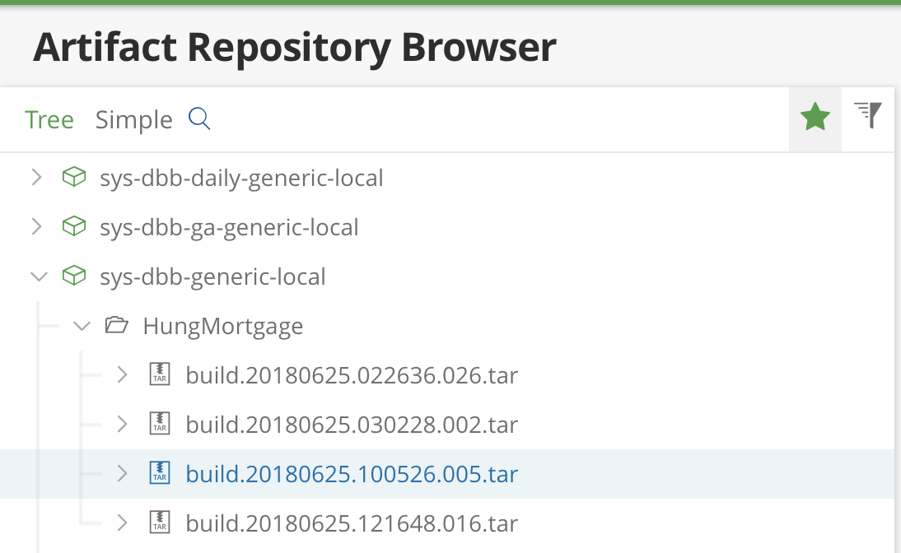
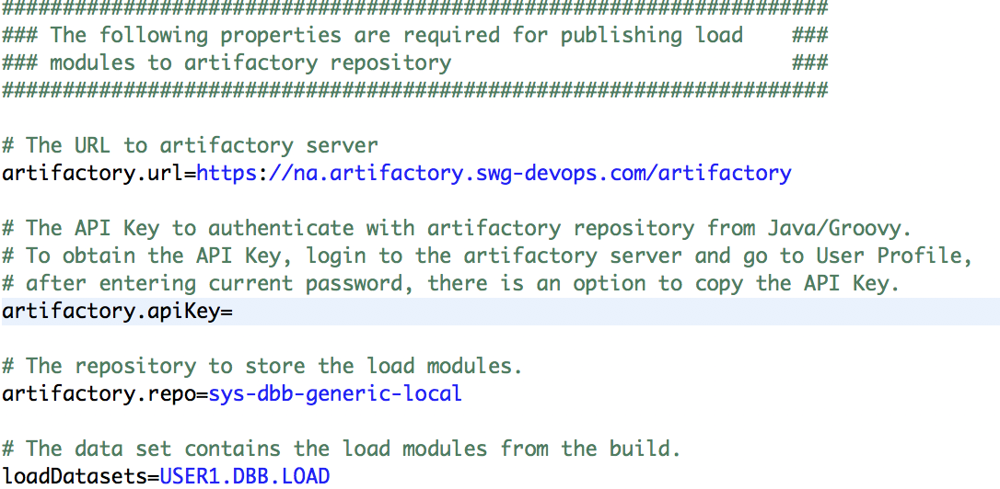
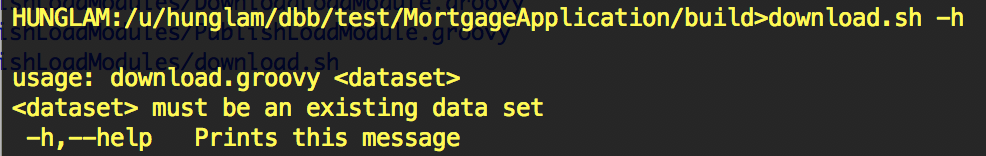

# Publish Load Modules to Artifactory Factory
This sample shows how to publish load modules to an artifactory repository after a successful build, as well as download load modules from the artifactory repository and restore them into an existing data set.  Since all of interaction with artifactory repository requires files on zFS, load modules need to copy from data set to files on zFS and vice-versa.  This sample therefore also makes use of the new options introduced in CopyToPDS and CopyToHFS APIs to copy between data set and files on zFS.

## Prerequisites:
This sample is built on top of the Mortgage Application Sample, so it requires a successful Mortgage setup.  It also requires a set of jar files which can be downloaded from Maven Central Repository.  These jar files are required for making REST service calls to Artifactory Repository using Groovy, see ArtifactoryHelpers.groovy for more details. 

## Scenario 1 - Publishing load modules from a successful build
1. After a successful Mortgage build, it retrieves all outputs from the build report.
2. From the list of the outputs, it filters the load modules based on the data sets specified in the build property 'loadDatasets'. For example: the build report could contain outputs from BMS, for example: USER1.DBB.COPYBOOKS(ESPMLIS), USER1.DBB.DBRM(EPSCMORT), USER1.DBB.LOAD(EPSCMORT), but the user is only interested in publishing load modules in USER1.DBB.LOAD. The build property 'loadDatasets' should then be set to  'USER1.DBB.LOAD' 
3. It then invokes CopyToHFS to copy the load modules from the PDSe to a temporary directory on zFS.
4. It packages these load files into a tar file, and compute the SHA1 and MD5 checksums.
5. It then publishes this tar file along with the checksums to the artifactory repository.

The artifactory repository would look something like this. The name of the tar is named after the build label and stored under the Collection.



### Required Changes
* Add the following properties to the build.properties



* From the build.groovy, after finalizing build report, add the following code to call the PublishLoadModule.groovy to retrieve the load modules from build report and publish

```
Class publishLoadModuleScript = new GroovyClassLoader(getClass().getClassLoader()).parseClass(new File("./PublishLoadModule.groovy"));
GroovyObject publishLoadModule = (GroovyObject) publishLoadModuleScript.newInstance();
publishLoadModule.run()
```

## Scenario 2 - Downloading load modules from artifactory repository
Note: It assumes that you have publish load modules from several successful builds.  A shell script download.sh is available to use to invoke the DownloadLoadModule.groovy.
Here is the usage of DownloadLoadModule.groovy:



1. It retrieves the latest uploaded tar file from the artifactory repository.
2. It then download this tar file to a temporary directory on zFS.
3. It then retrieves the remote SHA1 and MD5 checksums and compare with the local checksums to ensure the transfer is complete.
3. The load modules then are extracted from the tar file on zFS.
4. It then invokes CopyToPDS to restore these load modules on an existing data set.

### Required Changes
* The following build properties are required: **artifactory.url**, **artifactory.apiKey**, **artifactory.repo**, **collection**.
* The DownloadLoadModule.groovy also requires the name of an existing data set to copy the load modules to.

