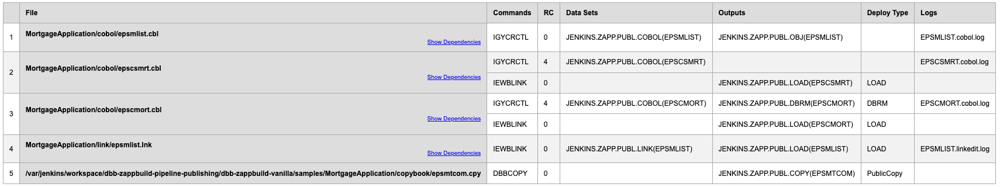

# Sample Script to publish shared interfaces to a central Git Repository

In our publication about managing the build scope across multiple repositories ([Managing the build scope in IBM DBB builds with IBM zAppBuild](https://www.ibm.com/support/pages/node/6381788)), a scenario is described, which publishes shared interfaces to a central Git repository.

These sample scripts are intended to provide guidance how-to implement this strategy. Overview of provided scripts:
- ```PublicCopybook.groovy``` is a new language script for [zAppBuild](https://github.com/IBM/dbb-zappbuild) to identify shared copybooks in the DBB BuildReport.json. It can also be used to build a language script for PLI includes or ASM macros.
- ```PublishPublicInterfaces.groovy``` is a post-build script, which 
  - parses the *BuildReport.json* in the supplied working dir and extracts the entries of **PublicCopy** with deploy type _PublicCopy_
  - copies the modified files to the location of the Git repository for the shared interfaces 
  - creates a new Commit in the Shared repo with a commit message containing the commit of the application repository for traceability. 


### Identify shared copybooks with ```PublicCopybook.groovy``` in the DBB BuildReport.json with zAppBuild

Add the PublicCopybook.groovy to your set of language scripts in zAppBuild and make the necessary configurations, e.q.
- In application.properties add the language script to the `buildOrder` so that it will be processed
```
# Comma separated list of the build script processing order
buildOrder=BMS.groovy,Cobol.groovy,LinkEdit.groovy,PublicCopybook.groovy
```
- In file.properties, assign the public copybooks to new language script
```
dbb.scriptMapping = PublicCopybook.groovy :: **/copybooks_public/*.cpy
```
With the above setup, public copybooks are added to the BuildReport.json leveraging the `deployType=PublicCopy`:



### Publish public interfaces in pipeline builds with ```PublishPublicInterfaces.groovy```
`PublishPublicInterfaces.groovy` is intended to be used as a build follow-up script in the pipeline build, e.q. your Jenkins job. It performs the following steps: 
- Read command line parameters
- Read DBB's BuildReport.json from the pipeline work directory
- Parse and extract records of type *CopyToPDSRecord* with `deployType=PublicCopy`
- Copy the physical files to the target directory of the Git repository of the shared interfaces. It uses a simplified directory structure **$properties.application/$filename**. Set the file tag.
- Adds changes to a git commit while adding the gitHash of the application source directory for traceability
- Pushes changes to the origin configuration 

#### Command Line Options Summary
```
$DBB_HOME/bin/groovyz <ussLocation>/PublishPublicInterfaces.groovy [options]

required options:

* usage: PublishPublicInterfaces.groovy [options]

options:
 -w,    --workDir <dir>             Absolute path to the directory containing DBB build
 -tHfs, --targetHfsDirectory        Path to Shared Git repo
 -v,    --verbose                   Enable verbose tracing
 -a,    --application               Application Name 

utility options
 -h, --help                         Prints this message

 ```

## Comments / Limitations
- While this script can be integrated in several pipeline jobs, a locking mechanism has been included to pause the script to avoid collisions
- Jenkins requires the permission to push the repository back to the central git provider. Jenkins does not provide any post-action to push to another repo.
- As outlined in the paper, different strategies can be applied for the branching strategy of the shared git repository - what represents production, what is currently in development. This is not yet taken into consideration for this implementation.


