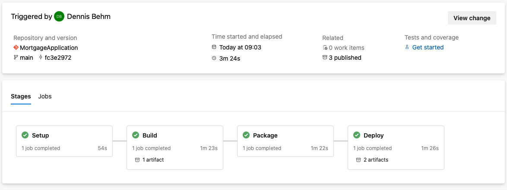
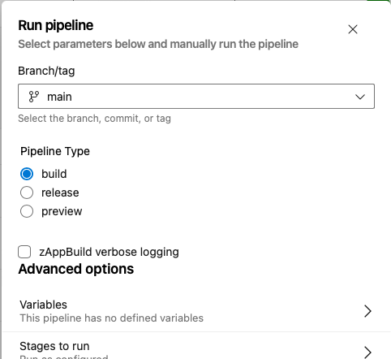

# Azure DevOps pipeline template

This template provides an [azure-pipelines.yaml](azure-pipelines.yml) definition file to setup an Azure DevOps Pipeline for applications managed in an Azure Git repository.

## Overview and capabilities

This pipeline template is implementing the [Git-based process and branching model for mainframe development](https://ibm.github.io/z-devops-acceleration-program/docs/git-branching-model-for-mainframe-dev) within an Azure DevOps context. It leverages the [Common Backend scripts](../Common-Backend-Scripts/) to implement the Setup, Build, Packaging and Deployment stages. 

The pipeline implements the following stages

* `Setup` stage to [clone](../Common-Backend-Scripts/README.md#41---gitclonesh) the Git repository to a workspace directory on z/OS Unix System Services. 
* `Build` stage 
  * to invoke the zAppBuild [build](../Common-Backend-Scripts/README.md#42---dbbbuildsh) framework,
  * to [prepare](../Common-Backend-Scripts/README.md#49---preparelogssh) the log files and publish them to the Azure build result.
* `Packaging` stage
  * to create a new [UCD component](../Common-Backend-Scripts/README.md#45---ucdpackagingsh) version (commented out)
  * to create a package (TAR file) based on the [PackageBuildOutputs script](../Common-Backend-Scripts/README.md#44---packagebuildoutputssh)
  * to load the package file to the Azure Artifacts
* `Deployment` stage
  * to run the Wazi Deploy [generate command](../Common-Backend-Scripts/README.md#47---wazideploy-generatesh)
  * to deploy the package with the Wazi Deploy [deploy command](../Common-Backend-Scripts/README.md#48---wazideploy-deploysh) (Python-based)
  * to run the Wazi Deploy [evidence command](../Common-Backend-Scripts/README.md#49---wazideploy-evidencesh) to generate deployment report and updating the evidence.
  * to [prepare](../Common-Backend-Scripts/README.md#49---preparelogssh) the deployment log files and publish them to the Azure build result.


The pipeline uses the Azure concepts `Stage`, `Jobs` and `Tasks`:



## Installation and setup

**Note: Please work with your ADO pipeline specialist to review the below section.**

The `azure-pipeline.yaml` can be dropped into the root folder of your Azure Git repository and will automatically provide pipelines for the specified triggers. Please review the definitions thoroughly with your Azure administrator. 

Following requirements need to be met:
* An [Azure Agent](https://learn.microsoft.com/en-us/azure/devops/pipelines/agents/agents?view=azure-devops) is installed and can connect to the z/OS system where builds are occurring.
* An [Azure SSH Service Connection](https://learn.microsoft.com/en-us/azure/devops/pipelines/library/service-endpoints?view=azure-devops&tabs=yaml#ssh-service-connection) is set up to connect to the z/OS system with SSH. This service connection is used by the Azure SSH-based tasks in the pipeline.
* The private SSH key of the TSO technical user to login to z/OS Unix System Services from scripts is installed as a Secure file. See [Install private SSH key](#install-private-ssh-key)

### Required pipeline variables

Variable | Description
--- | ---
  agentPool                            | Agent pool name for Azure Agents to connect to MVS
  zosSSHConnection                     | zOS - The name of the Azure SSH connection name for connecting to z/OS Unix System Services of the LPAR where the build actions will be performed.
  zosSSHKnownHost                      | The known host entry for secure shell connections. [See Notes](#obtaining-the-known-host-entry-for-secure-shell-connections).
  pipelineWorkspace                    | Root directory on z/OS Unix System services to perform builds. E.g. `/u/ado/workspace`
  wdEnvironmentFile                    | The Wazi Deploy environment file for the deployment into the lowest stage
  zosHostname                          | zOS - Host name (or Host IP address) for SFTP connection
  zosSFTPUser                          | zOS - Host user for SFTP connection
  azureArtifactFeedID                  | Feed ID of the Azure artifact for publishing the package (when publishing to Azure DevOps Artifacts)
  azureArtifactVersionOption           | Azure artifact version option (when publishing to Azure DevOps Artifacts)

### Installing the private SSH key

To execute actions on the z/OS system, the default communication channel is established via the SSH Service Connection that is provided by Azure.
To download files from the build workspace on z/OS Unix System Services, it requires to use a `CmdLine` task and write a script.
SSH communication from a `CmdLine` task does not use the Service Connection.
To make the agent installation independent of any configurations outside of Azure, a private SSH key is installed as part of the pipeline to connect to the z/OS system through a `CmdLine` task. 

The configuration requires 
1) the `zosSSHKnownHost` pipeline variable, and
2) uploading a Secure File `ssh_key_ado` that is referenced in the pipeline definition. 

#### Obtaining the known host entry for secure shell connections

For any actions over secure shell, that are executed outside of the Azure SSH Task, the pipeline is installing the private SSH key of the z/OS user and the entry for the `known_hosts` file.

**Obtaining the known host entry**

Open a terminal and issue `ssh-keyscan eoleb7.dat.ibm.com` - with using the z/OS hostname as argument.

 ```
    ssh-keyscan eoleb7.dat.ibm.com          
    # eoleb7.dat.ibm.com:22 SSH-2.0-OpenSSH_7.6
    eoleb7.dat.ibm.com ssh-rsa AAAAB3NzaC1yc2EAAAABIwAAAIEAwzoxzESrEqeWmAZNIa6NWJXh6l+BgX8JlZ3er1tMUAxKBEQ7aBKbCb+64P1m0TbpWhVMEYZBmHhpvAn6N86/4YLWCn8sJmshC9u7bag3dcSorIDO+/el2ochP+Ub4cD/V3DvOxVBsjK+a2nPBDZDbDjI5jdjEDfTC/uXRdQA3Qs=
    # eoleb7.dat.ibm.com:22 SSH-2.0-OpenSSH_7.6
    # eoleb7.dat.ibm.com:22 SSH-2.0-OpenSSH_7.6
```

Select the uncommented line as the value for the `zosSSHKnownHost` key of the pipeline variable.

#### Upload private SSH key as Secure File

To upload the private key as a Secure File: 

* obtain the private SSH key from the location where you generated it. For instance, use `scp` to download the private key to your workstation. 
* upload the private SSH key as a Secure File and set the appropriate permissions that the pipeline can use it. For more information, please checkout the [ADO documentation on Secure Files](https://learn.microsoft.com/en-us/azure/devops/pipelines/library/secure-files?view=azure-devops). 

## Pipeline usage

The pipeline implements a build, package and deploy pipeline to build the various configurations according to the defined conventions.
This sample does not provide a Azure release pipeline templates to deploy to higher-controlled test environments.

Please check the pipeline definition to understand the various triggers for which this pipeline is executed. 

### Pipeline parameters 

In a default setup, the pipeline is triggered after each new commit. It allows overriding the below parameters when manually requesting the pipeline.
This is especially useful when the application team want to create a release candidate package for higher test environments and production. 

Parameter | Description
--- | ---
pipelineType     | Pipeline type - either build, release or preview. (Default: build)
verbose          | boolean flag to control logging of build framework. (Default: false) 

