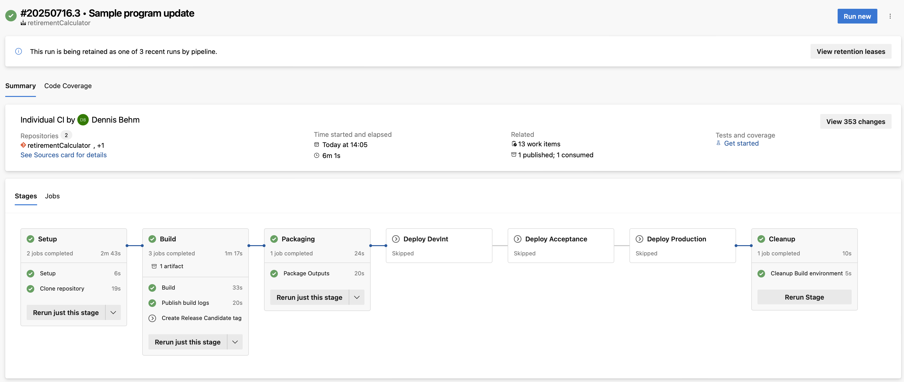
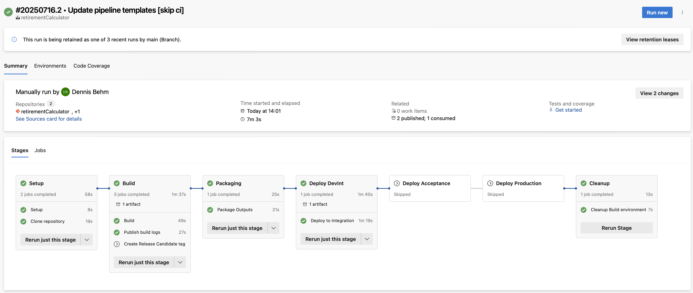
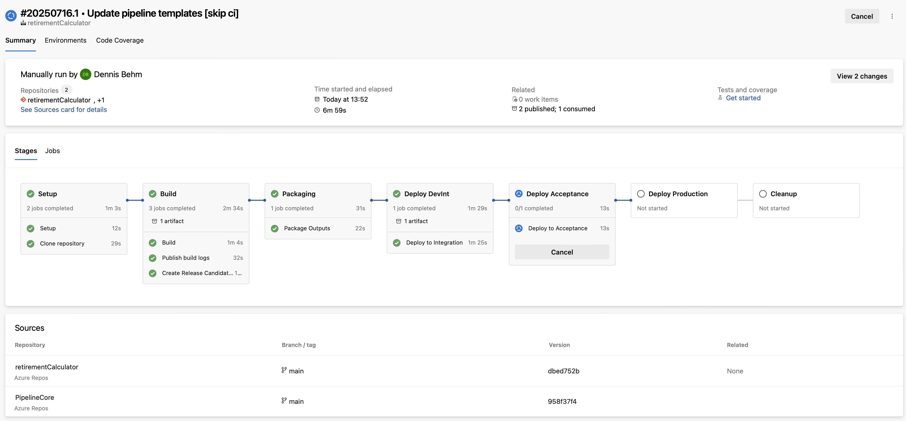

# Azure DevOps pipeline templates

This template provides an [azure-pipelines.yml](azure-pipelines.yml) definition file to setup an Azure DevOps Pipeline for applications managed in an Azure Git repository along with the [azure-pipeline-deploy.yml](azure-pipeline-deploy.yml) definition file as a dedicated pipeline to run the deployment/installation of an existing package via IBM Wazi Deploy for installing into controlled environments.

## Overview and capabilities

This pipeline template is implementing the [Git-based process and branching model for mainframe development](https://ibm.github.io/z-devops-acceleration-program/docs/working-practices-intro) within an Azure DevOps context.

It leverages the [Common Backend scripts](../Common-Backend-Scripts/) to implement the Setup, Build, Packaging and Deployment stages. 

The **development pipeline** [azure-pipelines.yml](azure-pipelines.yml) implements the following stages

* `Setup` stage to [clone](../Common-Backend-Scripts/README.md#clone-repository-with-gitclonesh) the Git repository to a workspace directory on z/OS Unix System Services. 
* `Build` stage 
  * to invoke the [build](../Common-Backend-Scripts/README.md#build-stage) stage for either zBuilder or zAppBuild,
  * to [prepare](../Common-Backend-Scripts/README.md#preparelogssh) the log files and publish them to the Azure build result.
* `Packaging` stage
  * to create a package (TAR file) based on the [PackageBuildOutputs script](../Common-Backend-Scripts/README.md#packaging-stage)
  * to publish the package file to the configured Artifact repository (Artifactory or Nexus, depending on the `publish` flag in CBS).
  * (Alternatively - commented out) to create a new [UCD component version](../Common-Backend-Scripts/README.md#ucdpackagingsh) version
* `Deployment` stage to deploy to the development test environment
  * to run the Wazi Deploy [generate command](../Common-Backend-Scripts/README.md#wazideploy-generatesh) to download the package from the configured Artifact repository and generate the Deployment Plan.
  * to deploy the package with the Wazi Deploy [deploy command](../Common-Backend-Scripts/README.md#wazideploy-deploysh) (Python-based)
  * to run the Wazi Deploy [evidence command](../Common-Backend-Scripts/README.md#wazideploy-evidencesh) to generate deployment report and updating the evidence.
  * to [prepare](../Common-Backend-Scripts/README.md#preparelogssh) the deployment log files and publish them to the Azure build result.
* `Deployment` stages to deploy to controlled test environments, if triggered the [release pipeline process](https://ibm.github.io/z-devops-acceleration-program/docs/branching-model-supporting-pipeline/#the-release-pipeline-with-build-package-and-deploy-stages) via a manual pipeline request with the pipelineType set to release `release`:
  * to create the release candidate Git tag using the [computeReleaseVersion script](../Common-Backend-Scripts/README.md#computereleaseversionsh).
  * to run the Wazi Deploy [generate command](../Common-Backend-Scripts/README.md#wazideploy-generatesh) to download the package from the configured Artifact repository and generate the Deployment Plan.
  * to deploy the package with the Wazi Deploy [deploy command](../Common-Backend-Scripts/README.md#wazideploy-deploysh) (Python-based) into development and test regions
  * to run the Wazi Deploy [evidence command](../Common-Backend-Scripts/README.md#wazideploy-evidencesh) to generate deployment report and updating the evidence.
  * to [prepare](../Common-Backend-Scripts/README.md#preparelogssh) the deployment log files and publish them to the Azure build result.
* `Cleanup` stage: 
  * to [delete the build workspace](../Common-Backend-Scripts/README.md#deleteworkspacesh) on z/OS Unix System Services.

The [**deployment pipeline** template [azure-pipeline-deploy.yml](azure-pipeline-deploy.yml) is a manually-driven pipeline that allows teams to deploy an application package that has previously been created by the application pipeline into controlled environments, such as acceptance and production environments.

It mandates the following input parameters:
* Target deployment environment selection
* Packaging information to retrieve the package from the artifact repository:
  * Package type - either a preliminary or release build
  * Package reference - either the branch name (like 'main') or release name (like 'rel-1.0.0') for the archive
  * Package identifier - the unique identifier of the build. The ADO build number

Based on the above information it kicks off the installation of the specified package

The pipeline uses the Azure concepts `Stage`, `Jobs` and `Tasks`, as well as [Azure DevOps templates](#supplied-azure-pipeline-templates).

## Prerequisites

To leverages this template, access to an Azure DevOps environment is required, and an Azure DevOps Pipeline agent must be configured to connect to your mainframe environment. Please review the setup instructions of this [techdoc](https://www.ibm.com/support/pages/node/6422813).

The template leverages the [SSH Task](https://learn.microsoft.com/en-us/azure/devops/pipelines/tasks/reference/ssh-v0?view=azure-pipelines) to invoke the [Common Backend scripts](../Common-Backend-Scripts/) via the configured SSH endpoint. Alternatively, the template can be modified to use the [CmdLine task](https://learn.microsoft.com/en-us/azure/devops/pipelines/tasks/reference/cmd-line-v2?view=azure-pipelines) to leverage an alternative communication technology such as Zowe CLI.

The Common Backend Scripts need to be configured for the selected deployment technologies to operate correctly. It is assumed that the Common Backend Scripts are configured to publish (upload) the package to the configured Artifact repository server, from where the deployment pipeline will automatically pick it up.

To tag important commits in the history of the application's Git repository, the Azure CLI is used and must be available on the Azure runner. Please follow the [documentation](https://learn.microsoft.com/en-us/cli/azure/install-azure-cli) to install the Azure CLI on all the agents within the agent pool that the pipelines will use.

## Installation and setup of template

**Note: Please work with your ADO pipeline specialist to review the below section.**

The `azure-pipeline.yml` and `azure-pipeline-deploy.yml` can be dropped into the root folder of your Azure Git repository and will automatically provide pipelines for the specified triggers. Please review the definitions thoroughly with your Azure administrator. The use of Templates is recommended for a centralized control of definitions.

Following requirements need to be met:
* An [Azure Agent](https://learn.microsoft.com/en-us/azure/devops/pipelines/agents/agents?view=azure-devops) is installed and can connect to the z/OS system where builds are occurring.
* An [Azure SSH Service Connection](https://learn.microsoft.com/en-us/azure/devops/pipelines/library/service-endpoints?view=azure-devops&tabs=yaml#ssh-service-connection) is set up to connect to the z/OS system with SSH. This service connection is used by the Azure SSH-based tasks in the pipeline.
* The private SSH key of the TSO technical user to login to z/OS Unix System Services from scripts is installed as a Secure file. See [Install private SSH key](#install-private-ssh-key)

### Required pipeline variables

Variable | Description
--- | ---
  agentPool                            | Agent pool name for Azure Agents to connect to MVS
  zosSSHConnection                     | zOS - The name of the Azure SSH connection name for connecting to z/OS Unix System Services of the LPAR where the build actions will be performed.
  zosSSHKnownHost                      | The known host entry for secure shell connections. [See Notes](#obtaining-the-known-host-entry-for-secure-shell-connections).
  zosSSHPrivateKeySecureFile           | Reference to uploaded Private SSH Key in ADO Pipeline/Libary/SecureFile that is installed for sftp processes. [See Notes](#upload-private-ssh-key-as-secure-file)
  pipelineWorkspace                    | Root directory on z/OS Unix System services to perform builds. E.g. `/u/ado/workspace`. Specifically to pull logs and build outputs.
  zosHostname                          | zOS - Host name (or Host IP address) for SFTP connection
  zosSFTPUser                          | zOS - Host user for SFTP connection

### Supplied Azure pipeline templates 

The directory [templates](templates/) contains additional [Azure pipeline templates](https://learn.microsoft.com/en-us/azure/devops/pipelines/process/templates?view=azure-devops&pivots=templates-includes#parameters-to-select-a-template-at-runtime) that implement actions used in the main pipeline templates. This approach helps to keep central control over the tagging and release deployment process. Please review the templates with your Azure administrator, store them at a central git repository, and adjust the reference within the [azure-pipelines.yml](azure-pipelines.yml#L33) file.

The tagging process implemented in the template leverages the [AZ REST command of the Azure DevOps CLI](templates/tagging/createReleaseCandidate.yml#L33) to connect with the existing permissions of the pipeline build user to the Azure repository to create the release candidate and the final release tag. Azure DevOps CLI needs to be available on the installed Azure agents.

### Azure environments

This template uses [Azure deployment jobs](https://learn.microsoft.com/en-us/azure/devops/pipelines/process/deployment-jobs?view=azure-devops) to trigger the deployment on the mainframe and document the deployment of packages to the defined [environments in Azure](https://learn.microsoft.com/en-us/azure/devops/pipelines/process/environments?view=azure-devops). Please create the environments in advance, also consider configuring approvals and checks for environments as gates.

The template allows the development team to add additional environments where they would like to deploy the package to. Please see the [deployment section of the pipeline configuration](azure-pipelines.yml#L309).

### Installing the private SSH key

To execute actions on the z/OS system, the default communication channel is established via the SSH Service Connection that is provided by Azure.
To download files from the build workspace on z/OS Unix System Services, the pipeline uses a `CmdLine` task and leverage a script to pull the log files from the mainframe to the Azure agent. The used SSH communication from a `CmdLine` task does not use the Azure Service Connection. To make the agent installation independent of any configurations outside of Azure, a private SSH key is installed as part of the pipeline to connect to the z/OS system through a `CmdLine` task. 

The configuration requires 
1) the `zosSSHKnownHost` pipeline variable, and
2) uploading a Secure File `ssh_key_ado` that is referenced in the pipeline definition. 

#### Obtaining the known host entry for secure shell connections

For any actions over secure shell, that are executed outside of the Azure SSH Task, the pipeline is installing the private SSH key of the z/OS user and the entry for the `known_hosts` file.

**Obtaining the known host entry**

Open a terminal and issue `ssh-keyscan eoleb7.dat.ibm.com` - with using the z/OS hostname as argument.

 ```
    ssh-keyscan eoleb7.dat.ibm.com          
    # eoleb7.dat.ibm.com:22 SSH-2.0-OpenSSH_7.6
    eoleb7.dat.ibm.com ssh-rsa AAAAB3NzaC1yc2EAAAABIwAAAIEAwzoxzESrEqeWmAZNIa6NWJXh6l+BgX8JlZ3er1tMUAxKBEQ7aBKbCb+64P1m0TbpWhVMEYZBmHhpvAn6N86/4YLWCn8sJmshC9u7bag3dcSorIDO+/el2ochP+Ub4cD/V3DvOxVBsjK+a2nPBDZDbDjI5jdjEDfTC/uXRdQA3Qs=
    # eoleb7.dat.ibm.com:22 SSH-2.0-OpenSSH_7.6
    # eoleb7.dat.ibm.com:22 SSH-2.0-OpenSSH_7.6
```

Select the uncommented line as the value for the `zosSSHKnownHost` key of the pipeline variable.

#### Upload private SSH key as Secure File

To upload the private key as a Secure File: 

* obtain the private SSH key from the location where you generated it. For instance, use `scp` to download the private key to your workstation. 
* upload the private SSH key as a Secure File and set the appropriate permissions that the pipeline can use it. For more information, please checkout the [ADO documentation on Secure Files](https://learn.microsoft.com/en-us/azure/devops/pipelines/library/secure-files?view=azure-devops). 

## Usage overview

This template implements the common build, package and deploy steps to process various configurations according to the conventions defined in the IBM zDevOps Guide.

Please make yourself familiar with the [Git branching for mainframe development](https://ibm.github.io/z-devops-acceleration-program/docs/working-practices-intro) documentation. 


### Development pipeline

The development pipeline definition supporting various workflows. The [azure-pipelines.yml](azure-pipelines.yml) supports: 

* automated [build pipelines for feature branches](https://ibm.github.io/z-devops-acceleration-program/docs/branching-model-supporting-pipeline#pipeline-build-of-feature-branches) with a clone and build stage, 
* the [basic pipeline](https://ibm.github.io/z-devops-acceleration-program/docs/branching-model-supporting-pipeline#the-basic-build-pipeline-for-main-epic-and-release-branches) when changes are merged into the branch `main` and
* a [release pipeline](https://ibm.github.io/z-devops-acceleration-program/docs/branching-model-supporting-pipeline#the-release-pipeline-with-build-packaging-and-deploy-stages) to build and package the release candidate, installation to predefined environments.

The deployment pipeline definition supports teams to install an existing package that is stored in an artifact repository

Please check the pipeline definition to understand the various triggers for which this pipeline is executed and also the conditions when stages, jobs or steps are executed. 

#### Development pipeline parameters 

In a default setup, the pipeline is triggered for each new commit.

It allows overriding the below parameters when manually requesting the pipeline.
This is especially useful when the application team want to create a release candidate package for higher test environments and production. 

Parameter | Description
--- | ---
pipelineType     | Pipeline type - either build, release or preview. (Default: build)
releaseType      | Release type - major, minor, patch as input to compute the release version and to set the release candidate and release git tags. (Default: patch)
verbose          | boolean flag to control logging of build framework. (Default: false) 

#### Supported workflows

##### Feature branch pipeline

The pipeline for feature branches executes the following steps:

* Clone
* Build
* Package & publish package
* Cleanup

Overview of the pipeline:  



##### Basic build pipeline for Integration branches

The basic build pipeline for integration branches contains the following stages:
* Clone
* Build 
* Package & publish package
* Deployment to the integration test environment
* Cleanup

Overview of the pipeline: 



##### Release pipeline

When the development team agrees to build a release candidate, the release pipeline type is triggered manually.

It covers the followings steps:
* Clone
* Build and creation of Git tagging for the release candidate
* Package & publish package
* Deployment to the integration test environment
* Deployment to the controlled test environments including Production
* Cleanup

The development team manually requests the pipeline and specifies the *pipeline type* `release` as a parameter. Along with the *release type*, the pipeline will tag a release candidate and also the final release that is deployed to production.


Overview of the release pipeline: 



### Deployment pipeline

A dedicated, manually invoked deployment pipeline template is provided to trigger the installation of an existing package from artifactory into more test and production environments, that are not on the default route for the application team. 

#### Pipeline parameters 

The pipeline is triggered manually by the team to request a deployment of an existing package. They need to specify the following information about the package:

Parameter | Description
--- | ---
deploymentEnvironment    | Target deployment environment - Environment where the package should be deployed to
packageType              | Package Type - a preliminary build or release package (Default: build)
packageReference         | Package Reference - either the branch name (like 'main') for preliminary build packages or the release name (like 'rel-1.5.0') for the release package type.
packageBuildIdentifier   | Package Build Identifier - Identifier for the archive, like build number

These information allow the CBS to find the package in the configured artifact repository.

#### Pipeline stages

The deployment pipeline contains following stages:
* Setup
* Deployment to selected runtime environment via IBM Wazi Deploy 
* Cleanup

Overview of the deploy pipeline request dialogue: 


Overview of the deployment pipeline stages:


### Usage notes

Build, package and deployment logs are attached to the Azure pipeline run and can be accessed via UI: 

