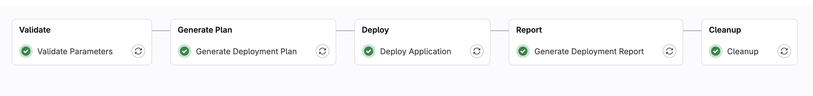

# GitLab Deployment Pipeline Template

This template provides a [.gitlab-ci.yml](.gitlab-ci.yml) definition file to set up a **GitLab CD (Continuous Deployment)** pipeline for applications managed in a GitLab Git repository.

## Overview and Capabilities

This pipeline template implements the [Git-based process and branching model for mainframe development](https://ibm.github.io/z-devops-acceleration-program/docs/git-branching-model-for-mainframe-dev) within a **GitLab CI/CD deployment-only context**.

It leverages the [Common Backend Scripts](https://github.com/IBM/dbb/blob/main/Templates/Common-Backend-Scripts/README.md) and **IBM Wazi Deploy** to perform automated deployments of pre-built application packages from an Artifact Repository into integration, acceptance, and production environments on z/OS.

The pipeline supports **manual and API triggers** and implements the following stages:

* `Validate` 

  * Validates the pipeline input parameters passed during manual or API trigger.
  * Determines the appropriate environment configuration file based on the selected target environment.
  * Ensures all required parameters (e.g., `application`, `buildId`, ..) are defined.

* `Generate Plan` 

  * Uses the Wazi Deploy script [`wazideploy-generate.sh`](../../Common-Backend-Scripts/wazideploy-generate.sh) to create the deployment plan on z/OS Unix System Services.
  * Supports both build-based and release-based deployments depending on the `packageType` value.

* `Deploy` 

  * Deploys the application using [`wazideploy-deploy.sh`](../../Common-Backend-Scripts/wazideploy-deploy.sh)
  * Executes the deployment against the selected target environment (integration, acceptance, or production).
  * Produces initial evidence files and deployment logs.

* `Report` 

  * Invokes [`wazideploy-evidence.sh`](../../Common-Backend-Scripts/wazideploy-evidence.sh) to generate a deployment report and evidence summary.
  * Downloads the report and evidence from z/OS Unix System Services to GitLab artifacts.
  * Updates the centralized Wazi Deploy evidence index for traceability.

* `Cleanup` 

  * Removes the temporary z/OS Unix System Services workspace using [`deleteWorkspace.sh`](../../Common-Backend-Scripts/deleteWorkspace.sh).
  * Cleans up intermediate files and temporary deployment directories.

---

Depending on the target environment and pipeline type, you can trigger this CD pipeline for:

Controlled deployments to **integration**, **acceptance** or **production** 

The pipeline uses the GitLab concepts of `stages` and `jobs`.



---

## Prerequisites

To leverage this template, access to a **GitLab CI/CD environment** and a properly configured **GitLab runner** capable of connecting to your z/OS environment is required.

Review the setup instructions provided in the IBM document:
[Integrating IBM z/OS platform in CI/CD pipelines with GitLab](https://www.ibm.com/support/pages/system/files/inline-files/Integrating%20IBM%20zOS%20platform%20in%20CICD%20pipelines%20with%20GitLab%20-%20v1.7_1.pdf).

This pipeline requires **Zowe CLI** to execute commands remotely on z/OS UNIX System Services (USS) using the `issue unix-shell` command, available in **IBM RSE API Plug-in for Zowe CLI version 4.0.0 or later**.

* The Zowe CLI `base` and `rse` profiles must be configured under `.zowe/zowe.config.json`:

```json
{
  "$schema": "./zowe.schema.json",
  "profiles": {
    "rse": {
      "type": "rse",
      "properties": {
        "port": 6800,
        "basePath": "rseapi",
        "protocol": "https"
      },
      "secure": []
    },
    "base": {
      "type": "base",
      "properties": {
        "host": "mainframe.hostname",
        "rejectUnauthorized": false
      },
      "secure": []
    }
  },
  "defaults": {
    "rse": "rse",
    "base": "base"
  },
  "autoStore": false
}
```

The [Common Backend Scripts](../Common-Backend-Scripts/) and Wazi Deploy must be properly installed and configured in the z/OS environment.

---

## Installation and Setup

**Note:** Please work with your DevOps or pipeline specialist to configure this template.

### Step 1: Configure GitLab CI/CD Variables

Navigate to **Settings → CI/CD → Variables** in your GitLab project and add the following variables, as **protected** and **masked**:

| Variable                   | Description                                          | Example Value              |
| -------------------------- | ---------------------------------------------------- | -------------------------- |
| `RSEAPI_USER`              | Username for RSE API server authentication (Zowe)   | `USERID`                   |
| `RSEAPI_PASSWORD`          | Password for RSE API user                            | `********`                 |
| `RSEAPI_WORKING_DIRECTORY` | Working directory path on USS for Zowe commands      | `/u/userid`                |
| `PIPELINE_WORKSPACE`       | Base workspace directory on USS for pipeline runs    | `/u/userid/pipeline-work`  |

### Step 2: Customize Pipeline Configuration

1. Place the [`.gitlab-ci.yml`](.gitlab-ci.yml) file in the **root directory** of your GitLab project.

2. Review and customize the following variables in the `.gitlab-ci.yml` file according to your environment:

   ```yaml
   variables:
     # Evidence directories - adjust paths as needed
     wdEvidencesRoot: /var/work/wazi_deploy_evidences_gitlab/
     wdEvidencesIndex: /var/work/wazi_deploy_evidences_gitlab_index/
   ```

3. Update the `targetEnvironment` options in the `spec.inputs` section to match your environment names:

   ```yaml
   spec:
     inputs:
       targetEnvironment:
         options:
           - "EOLEB7-Integration"
           - "EOLEB7-Acceptance"
           - "EOLEB7-Production"
   ```

### Step 3: Verify Prerequisites

Ensure the following are properly configured:

* **GitLab runner** with shell executor and access to z/OS USS environment
* **Zowe CLI** with RSE API plugin (version 4.0.0 or later) installed on the runner
* **Common Backend Scripts** deployed and accessible on z/OS USS
* **IBM Wazi Deploy** installed and configured on z/OS
* Corresponding environment configuration files (e.g., `EOLEB7-Integration.yml`) available in the Wazi Deploy environment configuration directory

---

## Pipeline Usage

This CD pipeline uses **GitLab CI/CD inputs** (introduced in GitLab 15.11) to provide a simplified, type-safe parameter interface. The pipeline supports **manual and API triggers** for both build and release deployments.

### Pipeline Inputs

The pipeline defines the following inputs with built-in validation:

| Input               | Type   | Required | Default              | Description                                                                                      |
| ------------------- | ------ | -------- | -------------------- | ------------------------------------------------------------------------------------------------ |
| `application`       | string | Yes      | -                    | Application name to deploy (e.g., `retirementCalculator`)                                        |
| `packageType`       | string | No       | `build`              | Type of package: `build` (preliminary) or `release`                                              |
| `packageReference`  | string | Yes      | -                    | Package reference - for releases: release name (e.g., `rel-2.6.0`), for builds: branch reference |
| `buildId`           | string | Yes      | -                    | Build identifier from the original build pipeline (e.g., `12247`)                                |
| `targetEnvironment` | string | No       | `EOLEB7-Integration` | Target deployment environment (dropdown selection)                                               |

**Note:** The pipeline uses GitLab's `spec.inputs` feature, which provides:
- Type validation and dropdown selections in the UI
- Clear parameter descriptions
- Default values for optional parameters
- Better API integration support

---

### Running the Pipeline via Manual Trigger

1. Navigate to **Build → Pipelines → Run Pipeline**
2. Select the branch for which the pipeline is selected to run
3. Fill in the pipeline inputs:

   **Example for Build Deployment:**
   ```
   application: retirementCalculator
   packageType: build
   packageReference: main
   buildId: 12247
   targetEnvironment: EOLEB7-Integration
   ```

   **Example for Release Deployment:**
   ```
   application: retirementCalculator
   packageType: release
   packageReference: rel-2.6.0
   buildId: 12247
   targetEnvironment: EOLEB7-Production
   ```

4. Click **Run pipeline**

## Pipeline Artifacts

After each deployment, the pipeline generates and publishes the following artifacts:

* **Deployment Report** (`deployment-report.html`) - HTML report with deployment details and status
* **Evidence File** (`evidence.yaml`) - YAML file containing deployment evidence for audit and compliance

These artifacts are available in the **Build → Pipelines → [Pipeline Run] → Job Artifacts at Stage 'Report'** section.


