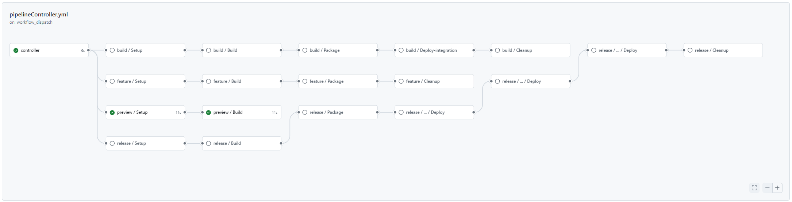
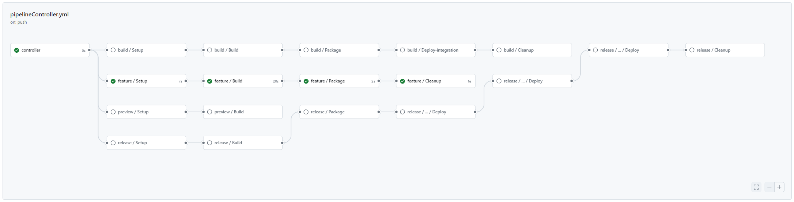
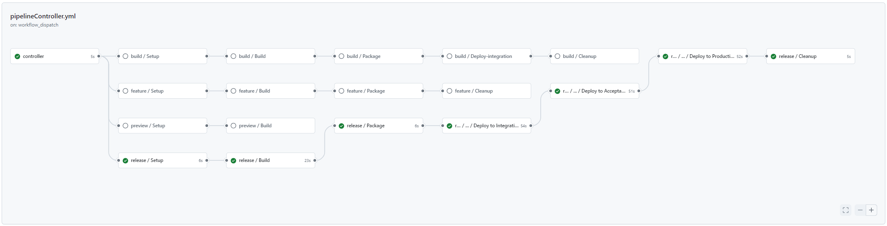

# GitHub Actions pipeline template 

This template provides multiple .yml files to setup a GitHub Actions pipeline for applications managed in a GitHub repository. 

## Overview & capabilities 

This pipeline template is implementing the [Git branching model for mainframe development](https://ibm.github.io/z-devops-acceleration-program/docs/branching/git-branching-model-for-mainframe-dev) within a GitHub Actions context.

It leverages the [Common Backend scripts](https://github.com/IBM/dbb/blob/main/Templates/Common-Backend-Scripts/README.md) to implement the Setup, Build, Packaging, Deployment, and Cleanup stages.

The pipeline implements the following stages:

 - `Setup` stage: 
   - [Clone](https://github.com/IBM/dbb/blob/main/Templates/Common-Backend-Scripts/README.md#41---gitclonesh) the Git repository to a workspace directory on z/OS Unix System Services.
 - `Build` stage:
   - Invoke the zAppBuild [build](https://github.com/IBM/dbb/blob/main/Templates/Common-Backend-Scripts/README.md#42---dbbbuildsh) framework.
   - [Prepare](https://github.com/IBM/dbb/blob/main/Templates/Common-Backend-Scripts/README.md#410---preparelogssh) the log files and publish them as GitHub Artifacts.
   - In the case of a release pipeline, to create the release candidate tag.
 - `Packaging` stage:
   - Create a .TAR file package based on the [PackageBuildOutput](https://github.com/IBM/dbb/blob/main/Templates/Common-Backend-Scripts/README.md#44---packagebuildoutputssh) script.
 - `Deploy Integration` stage:
   - Generate the deployment command with the Wazi Deploy [generate](https://github.com/IBM/dbb/blob/main/Templates/Common-Backend-Scripts/README.md#47---wazideploy-generatesh) command.
   - Deploy the package with the Wazi Deploy [deploy](https://github.com/IBM/dbb/blob/main/Templates/Common-Backend-Scripts/README.md#48---wazideploy-deploysh) command.
   - Generate the deployment report and update evidence with the Wazi Deploy [evidence](https://github.com/IBM/dbb/blob/main/Templates/Common-Backend-Scripts/README.md#49---wazideploy-evidencesh) command.
   - Publish deployment logs as a GitHub Artifact.
 - `Retrieve` stage:
   - Download the deployment plan with the Wazi Deploy [generate](https://github.com/IBM/dbb/tree/main/Templates/Common-Backend-Scripts#wazideploy-generatesh) script.
   - Deploy the package with the Wazi Deploy [deploy](https://github.com/IBM/dbb/blob/main/Templates/Common-Backend-Scripts/README.md#48---wazideploy-deploysh) command.
   - Generate the deployment report and update evidence with the Wazi Deploy [evidence](https://github.com/IBM/dbb/blob/main/Templates/Common-Backend-Scripts/README.md#49---wazideploy-evidencesh) command.
 - `Cleanup` stage:
   - [Delete the build workspace](https://github.com/IBM/dbb/blob/main/Templates/Common-Backend-Scripts/README.md#411---deleteworkspacesh) on z/OS Unix System Services.

Depending on your selected deployment technology, review the definitions and (de-)/activate the appropriate steps.

This pipeline uses the GitHub Actions concepts: `Stage`, `Jobs`, [Composite Actions](https://docs.github.com/en/actions/creating-actions/creating-a-composite-action), and the `GitHub CLI`.

## Prerequsities 
To leverage this template, access to a GitHub Actions environment is required, and a GitHub Actions runner must be configured to connect to your mainframe environment. 
This GitHub Actions runner will also require the [GitHub CLI](https://cli.github.com/), which is automatically included on GitHub hosted runners. 

Additionally, your GitHub repo will need to have the [Common Backend Scripts](https://github.com/IBM/dbb/tree/main/Templates/Common-Backend-Scripts) configured.

## Installation & setup 

**Note: Please work with your pipeline specialist to review this section.**

The `.github` folder, containing the `actions` and `workflows` subfolders can be dropped into the root folder of your GitHub repository, and will automatically provide pipelines for the specified triggers.

The following requirements need to be met:
 - An SSH connection to the z/OS machine. 

### Variable configuration 

The following variables will need to be defined and configured in the GitHub Repo.

Variable | Description
--- | ---
Personal Access Token Secret | A secret containing a personal access token

The following variables will need to be defined and configured in the pipeline definition files

Variable | Description | File(s)
--- | --- | ---
zosHostname | zOS - Host name / IP address for SFTP connection | Feature.yml, Build.yml, Release.yml, Preview.yml, Deploy.yml
zosSFTPUser | zOS - Host user for SFPT connection | Feature.yml, Build.yml, Release.yml, Preview.yml, Deploy.yml
githubAccessToken | A GitHub Personal Access Token used for authentication, matching the Personal Access Token Secret. In the template, this is secrets.SAMPLE_PAT | pipelineController.yml 

## Pipeline usage 

This pipeline implements the common build, package, and deploy steps to process various configurations according to defined conventions.
It is a combination of GitHub Actions pipeline definitions supporting various workflows. 
When used as intented, the combination of pipeline definitions supports:
 - Automated [build pipelines for feature branches](https://ibm.github.io/z-devops-acceleration-program/docs/branching-model-supporting-pipeline/#pipeline-build-of-feature-branches) with a clone and build stage.
 - A [basic pipeline](https://ibm.github.io/z-devops-acceleration-program/docs/branching-model-supporting-pipeline/#the-basic-build-pipeline-for-main-epic-and-release-branches) when changes are merged into the main branch.
 - A [release pipeline](https://ibm.github.io/z-devops-acceleration-program/docs/branching-model-supporting-pipeline/#the-release-pipeline-with-build-packaging-and-deploy-stages) to build and package the release candidate, including installation to predefined environments such as the integration environment. 
 - A [deploy pipeline](https://ibm.github.io/z-devops-acceleration-program/docs/branching-model-supporting-pipeline/#deployment-to-production) to deploy to a specified environment, such as an acceptance or production environment. 

Unlike other pipeline orchestrators, GitHub Actions encourages the use of multiple workflow files that will interact with each other. This template makes use of the following workflow files:

 - [pipelineController.yml](./workflows/pipelineController.yml) 
    - This pipeline is used to trigger the Feature, Build, Release, and Preview pipelines. 
 - [Feature.yml](./workflows/Feature.yml)
    - Pipeline for feature branch.
 - [Build.yml](./workflows/Build.yml)
    - The build pipeline.
 - [Release.yml](./workflows/Release.yml)
    - Pipeline for release branch.
 - [Preview.yml](./workflows/Preview.yml)
    - The preview pipeline, making use of dbbBuild.sh in the build stage.
 - [Preview-zBuilder.yml](./workflows/Preview-zBuilder.yml)
    - The zBuilder preview pipeline, making use of zBuilder.sh in the build stage.
 - [Deploy.yml](./workflows/Deploy.yml)
    - Pipeline for deploying to a specified environment.
 - [actions/createwazideployindex/action.yml](./actions/createwazideployindex/action.yml)
    - A composite action, used to copy the evidence file into the evidence inventory.
 - [actions/tagging_createproductionreleasetag/action.yml](./actions/tagging_createproductionreleasetag/action.yml)
    - A composite action, used to create the production release. 

Please review the pipeline definitions to understand the various triggers for which these pipelines may be executed, and also the conditions when stages, jobs, or steps are executed. 

Please make yourself familiar with the [Git branching for mainframe development](https://ibm.github.io/z-devops-acceleration-program/docs/git-branching-model-for-mainframe-dev/#characteristics-of-mainline-based-development-with-feature-branches) documentation. 

### Intended Personas and Seperation of Responsibility 

This pipeline template is intended to be used by two distinct personas, an application developer and a release manager. 

The application developer is intended to make use of the [pipeline controller](./workflows/pipelineController.yml), and has access to the [preview](./workflows/Preview.yml), [preview-zBuilder](./workflows/Preview-zBuilder.yml), [feature](./workflows/Feature.yml), [build](./workflows/Build.yml), and [release](./workflows/Release.yml) pipelines.

Excluding the preview and preview-zBuilder pipelines, all pipelines triggered by the pipeline controller will upload binaries to an artifact manager. Additionally, the only environment that the application developer can deploy to with the pipeline controller is the integration environment. 

The release manager is intended to make use of the [deploy](./workflows/Deploy.yml) pipeline, which will retrieve binaries from the artifact manager and deploy to a chosen environment. This includes any testing environment such as an acceptance environment, or production. 

Importantly, the application developer persona is not intended to have access to the [deploy](./workflows/Deploy.yml) pipeline. The release manager may or may not have access to the [pipeline controller](./workflows/pipelineController.yml). 

#### Workflow Diagram

### Pipeline variables 

In a default setup, the mainline pipeline is triggered for each new commit. 

When manually requesting a pipeline through the pipeline controller, the following variables can be overwritten:

Parameter | Description
--- | ---
pipelineType | Which type of pipeline is being run, either preview, build, or release. Defaults to testing. 
releaseType | Used for the release pipeline and deploy pipeline, which type of release is being released, either patch, minor, or major. Defaults to n/a.
verbose (wip) | Boolean flag to control logging of build framework. Defaults to false. (Note, this currently isn't an option that the developer can set) 

Additionally, when manually requesting a deploy pipeline, the following variables will need to be specified: 

Parameter | Description
--- | ---
environmentName |Specifies which environment should be used. Defaults to Integration. 
packageType | Specifies if the pipeline is deploying to a build environment or a release environment. 
packageReference | Specifies the package reference value. When deploying to release, a release version formatted as rel-#.#.# (ie rel-1.3.2) is expected. When not deploying to release, the branch name is expected.
packageBuildIdentifer | Helps to specify which artifact should be used when creating a deployment plan. Defaults to n/a. 

### Preview pipeline

The preview pipeline peforms the following: 
 - Clone
 - Build 

This pipeline can be manually triggered from any branch.

#### Overview of the pipeline:

### Preview zBuilder pipeline

The preview zBuilder pipeline peforms the following: 
 - Clone
 - Build 

This pipeline can be manually triggered from any branch.

#### Overview of the pipeline:

### Feature branch pipeline

The feature branch pipeline peforms the following: 
 - Setup
 - Build 
 - Package & publish package 

This pipeline runs automatically when pushing to a feature branch. It will also upload an artifact to your artifact manager of choice, allowing the binaries to be accessed by the Deploy.yml pipeline. 

#### Overview of the pipeline:

### Basic build pipeline for Integration branches 

The basic build pipeline for integration branches performs the following:
 - Setup
 - Build
 - Package & publish package 
 - Deploy to the integration test environment
 - Cleanup

This is the default pipeline, and runs automatically whenever there is a new commit to the main branch. 
Additionally, this pipleine can be run by manually running the pipelineController, with *pipelineType* as `build`.
It will also upload an artifact to your artifact manager of choice, allowing the binaries to be accessed by the Deploy.yml pipeline. 

#### Overview of the pipeline:

### Release pipeline

When the development team agrees to build a release candidate, the release pipeline is triggered manually. 

The release pipeline performs the following:
 - Setup
 - Build 
 - Tag the release candidate 
 - Package & publish package 
 - Deploy to the integration test environment 
 - Cleanup

This pipeline can be run by manually running the pipelineController, with *pipelineType* as `release`.
It will also upload an artifact to your artifact manager of choice, allowing the binaries to be accessed by the Deploy.yml pipeline. 

#### Overview of the pipeline:

### Deploy pipeline 

The deploy pipeline is used to deploy a build package to a given environment. It is intended to be used by a deployment manager persona. 

The deploy pipeline performs the following:
 - Setup
 - Deploy
   - When the pipeline is ran with a package type of `build`, only `wazideploy-generate.sh`, `wazideploy-deploy.sh`, and `wazideploy-evidence.sh` are ran. 
 - Cleanup

This pipeline can be run manually via a workflow_dispatch trigger. 
You will  need to specify a release type, build identifier, environment name, package type, and release version. 

#### Overview of the pipeline: 

## Known issues / WIP / Missing features

This is a non-comprehensive list of items that are either a known issue, a work in progress, or something that still needs to be implemented. 

### High Importance 

### Medium Importance 
- the baseline reference file is not automatically updated when a new version is released
- the `verbose` flag is not implemented on the pipeline controller 

### Low Importance 
- the computeReleaseVersion.sh common backend script is used 3 times in Release.yml, when it should only be used once. 

## Reference & additional resources 

This was made by using the [Azure DevOps template](https://github.com/IBM/dbb/blob/main/Templates/AzureDevOpsPipeline/README.md) alongside the GitHub [Actions importer](https://docs.github.com/en/actions/migrating-to-github-actions/automated-migrations/automating-migration-with-github-actions-importer) and the [GitLab DevOps template](https://github.com/IBM/dbb/blob/main/Templates/GitlabCIPipeline/README.md) as a reference.

Additionally, this video on [Creating a DevOps Pipeline with GitHub Actions](https://mediacenter.ibm.com/media/CICD+-+Creating+a+DevOps+Pipeline+with+Github+Actions/1_1qhqzg3l) provides an introduction to GitHub Actions. 
