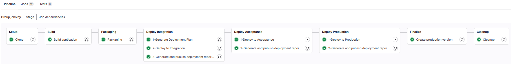
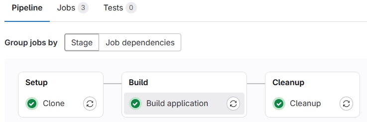
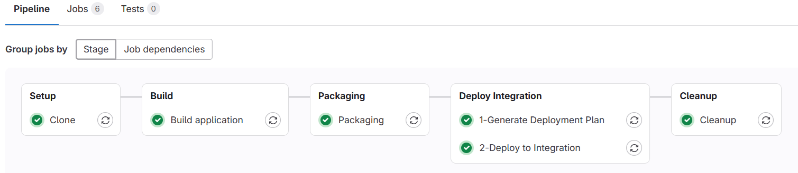

# z/OS-native GitLab DevOps pipeline template
This template provides a [.gitlab-ci.yml](.gitlab-ci.yml) pipeline definition file to setup a GitLab CI/CD pipeline using the z/OS-native GitLab Runner for applications managed in an GitLab Git repository.
The z/OS-native GitLab Runner is now officially available, more information can be found [here](https://about.gitlab.com/blog/gitlab-ultimate-for-ibm-z-modern-devsecops-for-mainframes/).

## Overview and capabilities
This pipeline template is implementing the [Git-based process and branching model for mainframe development](https://ibm.github.io/z-devops-acceleration-program/docs/branching/git-branching-model-for-mainframe-dev/) within an GitLab CI/CD context.

It leverages the [Common Backend Scripts](https://github.com/IBM/dbb/blob/main/Templates/Common-Backend-Scripts/README.md) to implement the Setup, Build, and Deployment stages.

The pipeline implements the following stages:
* `Setup` stage to clone the Git repository to a unique workspace directory on z/OS Unix System Services using the [clone](../Common-Backend-Scripts#clone-repository-with-gitclonesh) script.
* `Build` stage:
  * to compute the next release version using the [computeReleaseVersion script](../Common-Backend-Scripts/README.md#computereleaseversionsh) and create a release candidate Git tag when `pipelineType` is `release`.
  * to invoke the [zBuilder](../Common-Backend-Scripts/README.md#zbuildersh-for-dbb-zbuilder) build framework, which also handles packaging and publishing the build outputs.
  * to upload the log files and publish them as GitLab artifacts.
* `Deploy Integration` stage to deploy to the development / integration test environment that includes:
  * to generate the deployment plan with the Wazi Deploy [generate command](../Common-Backend-Scripts/README.md#wazideploy-generatesh).
  * to deploy the package with the Wazi Deploy [deploy command](../Common-Backend-Scripts/README.md#wazideploy-deploysh) (Python-based).
  * to run the Wazi Deploy [evidence command](../Common-Backend-Scripts/README.md#wazideploy-evidencesh) to generate deployment report and update the evidence.
  * to publish deployment log files to GitLab Artifacts of the pipeline run.
  * Triggered automatically for commits to `main`, `release/*`, and `epic/*` branches when `pipelineType` is not `preview`.
* `Deploy Acceptance` stage to deploy to a controlled test environment via the [release pipeline](https://ibm.github.io/z-devops-acceleration-program/docs/branching-model-supporting-pipeline#the-release-pipeline-with-build-packaging-and-deploy-stages) that includes:
  * to deploy the package with the Wazi Deploy [deploy command](../Common-Backend-Scripts/README.md#wazideploy-deploysh) (Python-based) — triggered manually.
  * to run the Wazi Deploy [evidence command](../Common-Backend-Scripts/README.md#wazideploy-evidencesh) to generate deployment report and update the evidence.
  * to publish deployment log files to GitLab Artifacts of the pipeline run.
  * Only triggered when `pipelineType` is `release` on `main`, `release/*`, or `epic/*` branches.
* `Deploy Production` stage to deploy to the production environment via the release pipeline that includes:
  * to deploy the package with the Wazi Deploy [deploy command](../Common-Backend-Scripts/README.md#wazideploy-deploysh) (Python-based) — triggered manually.
  * to run the Wazi Deploy [evidence command](../Common-Backend-Scripts/README.md#wazideploy-evidencesh) to generate deployment report and update the evidence.
  * to publish deployment log files to GitLab Artifacts of the pipeline run.
  * to create a release tag and, when running on `main`, create the next release maintenance branch according to the [scaling up guidelines](https://ibm.github.io/z-devops-acceleration-program/docs/branching/git-branching-model-for-mainframe-dev/#scaling-up).
  * to update the [baselineRef.yaml](../Common-Backend-Scripts/samples/baselineRef.yaml) file to include the reference to the new release version and push the change back to the branch.
  * Only triggered when `pipelineType` is `release` on `main` or `release/*` branches.
* `Cleanup` stage:
  * to [delete the build workspace](../Common-Backend-Scripts/README.md#deleteworkspacesh) on z/OS Unix System Services.

Depending on your selected deployment technology, review the definitions and (de-)/activate the appropriate steps.

The pipeline uses the GitLab concepts: `Stage` and `Jobs`.

## Prerequisites

To leverage this template, access to a GitLab CI/CD environment is required, and a z/OS-native GitLab Runner must be configured.

The [Common Backend scripts](../Common-Backend-Scripts/) need to be configured for the selected deployment technologies to operate correctly.

## Installation and setup of template

**Note: Please work with your pipeline specialist to review the below section.**

The `.gitlab-ci.yaml` can be dropped into the root folder of your GitLab Git repository and will automatically provide pipelines for the specified triggers. Please review the definitions thoroughly with your GitLab administrator.

### Variables configuration
The following variables need to be defined and configured as the environment variables in the GitLab group or project setting:

Variable | Description | Value
--- | --- | ---
AutomationToken | [Group access token](https://docs.gitlab.com/ee/api/rest/#personalprojectgroup-access-tokens) to be used for authentication when invoking GitLab REST API interfaces for tagging and branch creation. | No default value
GIT_CLONE_PATH | Even if not used in the cloning process, it defines the absolute location where artifacts are meant to be found during the artifact upload. | $CI_BUILDS_DIR/$CI_PROJECT_NAME/build-$CI_PIPELINE_ID

The following variables need to be updated within the pipeline definition file: `.gitlab-ci.yaml`.

Variable | Description
--- | ---
application | Specify the name of your application which will be used to invoke the [Common Backend scripts](../Common-Backend-Scripts/).
wdEnvironmentFileIntegration | Path to a Wazi Deploy configuration file for the integration environment.
wdEnvironmentFileAcceptance | Path to a Wazi Deploy configuration file for the acceptance environment.
wdEnvironmentFileProduction | Path to a Wazi Deploy configuration file for the production environment.

## Pipeline usage

The pipeline implements the common build and deploy steps to process various configurations according to the defined conventions.
It is a single GitLab CI/CD pipeline definition supporting various workflows. The [.gitlab-ci.yml](.gitlab-ci.yml) supports:

* automated [build pipelines for feature branches](https://ibm.github.io/z-devops-acceleration-program/docs/branching-model-supporting-pipeline#pipeline-build-of-feature-branches) with a clone and build and package stage,
* the [basic pipeline](https://ibm.github.io/z-devops-acceleration-program/docs/branching-model-supporting-pipeline#the-basic-build-pipeline-for-main-epic-and-release-branches) when changes are merged into `main`, `release/*`, or `epic/*` branches, and
* a [release pipeline](https://ibm.github.io/z-devops-acceleration-program/docs/branching-model-supporting-pipeline#the-release-pipeline-with-build-packaging-and-deploy-stages) to build the release candidate and deploy it through integration, acceptance, and production environments.

Please check the pipeline definition to understand the various triggers for which this pipeline is executed and also the conditions when stages and jobs are executed.

To fully understand the pipeline implementation, it is recommended to get familiar with the [Git branching for mainframe development](https://ibm.github.io/z-devops-acceleration-program/docs/branching/git-branching-model-for-mainframe-dev/#characteristics-of-trunk-based-development-with-feature-branches) documentation.

### Pipeline variables

In a default setup, the basic pipeline is triggered for each new commit.

It allows overriding the value of the below variables when manually requesting the pipeline. This is especially useful when the application team wants to create a release candidate for higher test environments and production.

Parameter | Description
--- | ---
pipelineType     | Pipeline type - either `build`, `release`, or `preview`. (Default: `build`)
releaseType      | Release type - `major`, `minor`, or `patch` as input to compute the release version and to set the release candidate and release Git tags. (Default: `minor`)
verbose          | Flag to enable verbose logging of the build framework. (Default: disabled)

### Feature Branch pipeline (preview mode)

The pipeline for feature branches executes the following steps:

* Clone
* Build executed with the `--preview` option (no new load modules are created)

This pipeline is run manually with the *pipelineType* variable set to `preview`. Setting `pipelineType` to `preview` suppresses all deploy stage jobs regardless of the branch.

Overview of the pipeline:  

### Basic build pipeline for Integration branches

The basic build pipeline for integration branches (`main`, `release/*`, `epic/*`) contains the following stages:
* Clone
* Build
* Deployment to the integration test environment
* Cleanup

This is a default pipeline. It runs automatically when there is a new commit to a repository. You can also run this pipeline manually by setting the *pipelineType* variable as `build`.

Overview of the pipeline:

### Release pipeline

When the development team agrees to build a release candidate, the release pipeline type is triggered manually.

It covers the following steps:
* Clone
* Build: compute the next release version, create a release candidate Git tag (`rel-<version>-<pipelineId>`), and invoke zBuilder
* Deployment to the integration test environment
* Deployment to the acceptance test environment (required to be triggered manually)
* Deployment to the production environment (required to be triggered manually)
* Post-production finalization:
  * Create the final release Git tag
  * Update [baselineRef.yaml](../Common-Backend-Scripts/samples/baselineRef.yaml) with the new release reference and push the change back to the branch
  * When running on `main`: create the next release maintenance branch (`release/<nextVersion>`)
* Cleanup

The development team manually requests the pipeline and specifies the *pipelineType* variable as `release`. Along with the *releaseType*, the pipeline will automatically calculate the release tag based on the information in the [baselineRef.yaml](../Common-Backend-Scripts/samples/baselineRef.yaml) file, tag a release candidate, and also create the final release tag after the production deployment.

Overview of the release pipeline:

