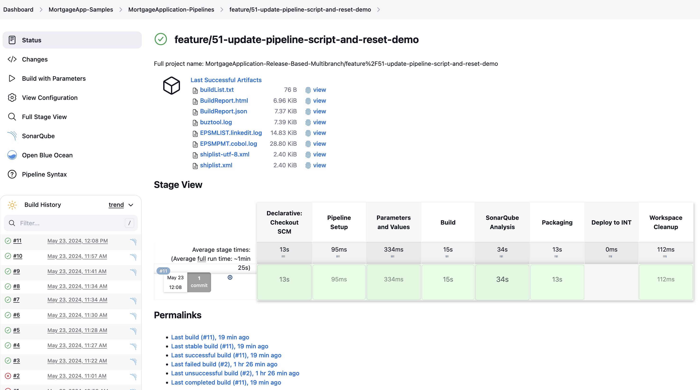
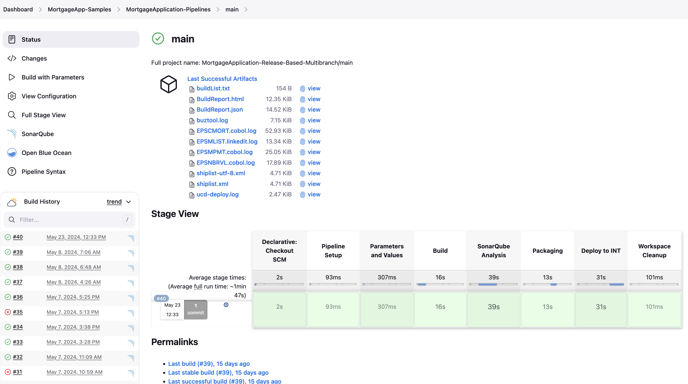
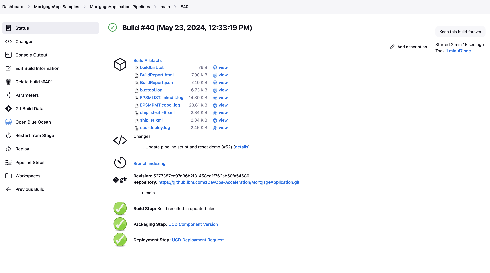

# Jenkins Pipeline template

This template provides a [Jenkinsfile](Jenkinsfile) definition to set up a Jenkins Multibranch pipeline compatible with any Git provider.

## Overview and capabilities

This pipeline template is implementing the [Git-based process and branching model for mainframe development](https://ibm.github.io/z-devops-acceleration-program/docs/git-branching-model-for-mainframe-dev) with Jenkins as a the Pipeline Orchestrator.

It leverages the [Common Backend Scripts](https://github.com/IBM/dbb/blob/main/Templates/Common-Backend-Scripts/README.md) in the Build, Packaging, and Deployment stages.

The pipeline implements the following stages:

* `Checkout` stage to clone the Git repository to a workspace directory on z/OS UNIX System Services using the integrated Git Plugin of Jenkins.
* `Pipeline Setup` to compute the settings for subsequent stages, that are displayed in the `Parameters and Values` stage.
* `Build` stage 
  * to invoke zAppBuild via the [dbbBuild.sh](../Common-Backend-Scripts/README.md#42---dbbbuildsh) Common Backend Script,
  * to publish log files to the Jenkins build result.
* `SonarQube Analysis` stage to request a SonarQube scan of the application repository.
* `Packaging` stage
  * to create an UrbanCode Component version via the Common Backend Script [ucdPackaging.sh](../Common-Backend-Scripts/README.md#45---ucdpackagingsh),
  * to publish packaging log files to the Jenkins build result,
  * to add links to the UCD Component version.
* `Deploy to INT` stage to deploy to the development / integration test environment that includes:
  * to request the Deployment of the UrbanCode Component version via the Common Backend Script [ucdDeploy.sh](../Common-Backend-Scripts/README.md#46---ucddeploysh) to the shared Development/Integration test environment,
  * to publish deployment log files to the Jenkins build result,
  * to add links to the UCD Deployment request.
 * `Workspace Cleanup` stage to clean up the workspace.

Depending on your selected and software analysis and deployment technology, review the definitions and (de-)/activate the appropriate steps.

The pipeline is implemented as a declarative pipeline.

## Prerequisites

The [Common Backend Scripts](../Common-Backend-Scripts/) need to be configured for the selected technologies to operate correctly.

## Installation and setup of template

**Note: Please work with your pipeline specialist to review the below section.**

The `Jenkinsfile` can be placed into the root folder of your Git repository and will automatically provide pipelines for the specified triggers defined in the Jenkins Multibranch Pipeline job configuration.

Please review the definitions thoroughly with your Jenkins administrator. Ideally, the Jenkinsfile is converted into a [Jenkins Shared Library](https://www.jenkins.io/doc/book/pipeline/shared-libraries/) to provide stronger, central control.

Step-by-step instructions to define and configure a Jenkins Multibranch Pipeline is documented at: https://www.jenkins.io/doc/book/pipeline/multibranch/

## Pipeline usage

The pipeline template implements the common clone, build, package and deploy steps to process various configurations according to the defined conventions. It leverages the a declarative checkout of the application's Git repository.

It is supporting the following workflows: 

* automated [build pipelines for feature branches](https://ibm.github.io/z-devops-acceleration-program/docs/branching-model-supporting-pipeline#pipeline-build-of-feature-branches) with a clone and build stage
* [basic pipeline](https://ibm.github.io/z-devops-acceleration-program/docs/branching-model-supporting-pipeline#the-basic-build-pipeline-for-main-epic-and-release-branches) triggered when feature branches are merged into the branch `main`
* [release pipeline](https://ibm.github.io/z-devops-acceleration-program/docs/branching-model-supporting-pipeline/#the-release-pipeline-with-build-package-and-deploy-stages) to build, package and deploy a release via UCD

The `Pipeline setup` stage within the [template](Jenkinsfile#L165) configures the subsequent stages, including flags used as conditions when stages and jobs are executed. Please review this stage.

This template is implementing the recommended [Git branching model for mainframe development](https://ibm.github.io/z-devops-acceleration-program/docs/git-branching-model-for-mainframe-dev). If you have not done so yet, we recommend to get familiar with the concepts described in this documentation.

### Pipeline variables

In a default setup, the feature and basic pipelines are triggered for each new commit as soon as the Multibranch integration detects the changes.

The pipeline allows to override the values of the below variables when manually requesting the pipeline. This is especially useful when the application team wants to create a release candidate package for higher test environments and production.

Parameter | Description
--- | ---
pipelineType     | Pipeline type - either build, release or preview. (Default: build)
verbose          | Boolean flag to control logging of build framework. (Default: false)
<!-- releaseType      | Release type - major, minor, patch as input to compute the release version and to set the release candidate and release git tags. (Default: patch) //-->

### Feature Branch pipeline

The pipeline for feature branches executes the following steps:

* Setup
* Clone
* Build
* SonarQube Analysis
* Packaging

To run zAppBuild in preview mode (that is, processing all phases of the build option, but not actually executing the commands), this pipeline can be manually requested with setting the *pipelineType* variable to `preview`.

Overview of the pipeline:  

Pipelines for Feature, Epic, and Release Maintenance branches perform the same steps as a feature branch pipeline. 

### Basic build pipeline when merging into the main branch

The basic build pipeline for the `main` branch contains the following stages:

* Setup
* Clone
* Build (with TEST options)
* SonarQube Analysis
* Packaging
* Request deployment to the integration test environment

It runs automatically when there is a new commit to the application repository's `main` branch. `dbbBuild.sh` (from the Common Backend Scripts) will automatically extract the Git tag based on the information in the [baselineReference.config](../Common-Backend-Scripts/samples/baselineReference.config). The `baselineReference.config` file is expected to be maintained in the application's Git repository.

You can also run this pipeline manually to override [the pipeline parameters](#pipeline-variables), for instance to set the *pipelineType* variable to `preview` to run zAppBuild in preview mode and skip the packaging steps.

Overview of the pipeline:

Links are created within the Jenkins build result, to take the user to the package and the deployment request within UCD:

### Release pipeline

When the development team agrees to build a release candidate, the release pipeline type is triggered manually for the `main` branch. The development team manually requests the execution of the pipeline and sets the *pipelineType* variable as `release`. Per the recommended branching model, release packages are only created from the `main` branch.

It supports the same steps as the basic build pipeline:

* Setup
* Clone
* Build (now with the optimize compile options)
* SonarQube Analysis
* Packaging
* Request deployment to the integration test environment

The user can then use UCD to deploy the release candidate package to the higher test environments. At the time of the production deployment, a release tag and a release can be created in the Git repository of choice. This can be automated as part of the deployment process to create a Git tag for the commit of the release pipeline build. 

Overview of the release pipeline:

