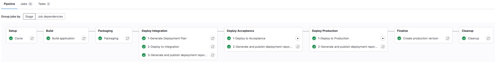
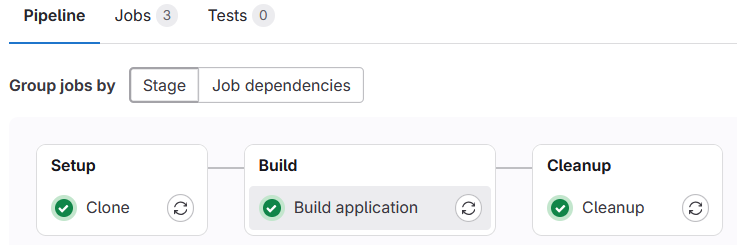
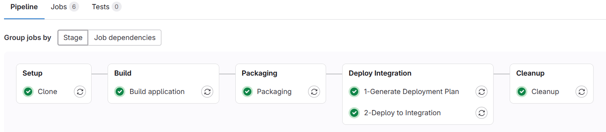

# z/OS-native GitLab DevOps pipeline template
This template provides a [.gitlab-ci.yml](.gitlab-ci.yml) pipeline definition file to setup a GitLab CI/CD pipeline using the z/OS-native GitLab Runner for applications managed in an GitLab Git repository.
The z/OS-native GitLab Runner is now officially available, more information can be found[here](https://about.gitlab.com/blog/gitlab-ultimate-for-ibm-z-modern-devsecops-for-mainframes/).

## Overview and capabilities
This pipeline template is implementing the [Git-based process and branching model for mainframe development](https://ibm.github.io/z-devops-acceleration-program/docs/branching/git-branching-model-for-mainframe-dev/) within an GitLab CI/CD context.

It leverages the [Common Backend Scripts](https://github.com/IBM/dbb/blob/main/Templates/Common-Backend-Scripts/README.md) to implement the Setup, Build, Packaging and Deployment stages.

The pipeline implements the following stages
* `Setup` stage to clone the Git repository to a workspace directory on z/OS Unix System Services using built-in clone capabilities of the GitLab Runner (still calling the git command on z/OS Unix Systems Services).
* `Build` stage 
  * to invoke the zBuilder [build](../Common-Backend-Scripts/README.md#zbuildersh-for-dbb-zbuilder) framework,
  * to upload the log files and publish them as GitLab artifacts.
* `Packaging` stage
  * to create a package (TAR file) based on the [PackageBuildOutputs script](../Common-Backend-Scripts/README.md#packagebuildoutputssh)
  * in case of a release pipeline, to create the release candidate tag.
* `Deploy Integration` stage to deploy to the development / integration test environment that includes:
  * to run the Wazi Deploy and generate deployment plan [generate command](../Common-Backend-Scripts/README.md#wazideploy-generatesh)
  * to deploy the package with the Wazi Deploy [deploy command](../Common-Backend-Scripts/README.md#wazideploy-deploysh) (Python-based)
  * to run the Wazi Deploy [evidence command](../Common-Backend-Scripts/README.md#wazideploy-evidencesh) to generate deployment report and updating the evidence.
  * to publish deployment log files to the GitLab Artifacts.
  * to store the Wazi Deploy evidence files at a shared location to support later reporting scenarios.
* `Deploy Acceptance` and `Deploy Production` stages to deploy to controlled test environments via the [release pipeline](https://ibm.github.io/z-devops-acceleration-program/docs/branching-model-supporting-pipeline#the-release-pipeline-with-build-packaging-and-deploy-stages) that includes:
  * to deploy the package with the Wazi Deploy to targeted environment [deploy command](../Common-Backend-Scripts/README.md#wazideploy-deploysh) (Python-based)
  * to run the Wazi Deploy [evidence command](../Common-Backend-Scripts/README.md#wazideploy-evidencesh) to generate deployment report and updating the evidence.
  * to publish deployment log files to the GitLab Artifacts.
  * to store the Wazi Deploy evidence files at a shared location to support later reporting scenarios.
* `Finalize` stage to create a release tag from [baseline reference file](../Common-Backend-Scripts/samples/baselineReference.config) and create a release maintenance branch as described in the [scaling up gideline](https://ibm.github.io/z-devops-acceleration-program/docs/git-branching-model-for-mainframe-dev/#scaling-up).
* `Cleanup` stage:
  * to [delete the build workspace](../Common-Backend-Scripts/README.md#deleteworkspacesh) on z/OS Unix System Services.

Depending on your selected deployment technology, review the definitions and (de-)/activate the appropriate steps.

The pipeline uses the GitLab concepts: `Stage`and `Jobs`.

## Prerequisites

To leverage this template, access to a GitLab CI/CD environment is required, and a z/OS-native GitLab Runner must be configured.
The pipeline template makes use of the of `GIT_CLONE_PATH` variable to specify the location of the Git repository on z/OS Unix Systems Services. For this to work, the z/OS-native GitLab Runner must have the `custom_dirs` feature enabled.

The [Common Backend scripts](../Common-Backend-Scripts/) need to be configured for the selected deployment technologies to operate correctly.

## Installation and setup of template

**Note: Please work with your pipeline specialist to review the below section.**

The `.gitlab-ci.yaml` can be dropped into the root folder of your GitLab Git repository and will automatically provide pipelines for the specified triggers. Please review the definitions thoroughly with your GitLab administrator.

### Variables configuration
The following variables need to be defined and configured as the environment variables in the GitLab group or project setting:

Variable | Description
--- | ---
AutomationToken | [Group access token](https://docs.gitlab.com/ee/api/rest/#personalprojectgroup-access-tokens) to be used for authentication when invoke GitLab CLI REST interfaces.

The following variables need to be updated within the pipeline definition file: `.gitlab-ci.yaml`.

Variable | Description
--- | ---
application | Specify the name of your application which will be used to invoke the [Common Backend scripts](../Common-Backend-Scripts/).
wdEnvironmentFileIntegration | Path to a Wazi Deploy configuration file for integration environment.
wdEnvironmentFileAcceptance | Path to a Wazi Deploy configuration file for acceptance environment.
wdEnvironmentFileProduction | Path to a Wazi Deploy configuration file for production environment.
baselineReferenceFile | Path to baselineReference.config file of your application.

## Pipeline usage

The pipeline implements the common build, package, and deploy steps to process various configurations according to the defined conventions.
It is a single GitLab CI/CD pipeline definition supporting various workflows. The [.gitlab-ci.yml](.gitlab-ci.yml) supports: 

* automated [build pipelines for feature branches](https://ibm.github.io/z-devops-acceleration-program/docs/branching-model-supporting-pipeline#pipeline-build-of-feature-branches) with a clone and build stage,
* the [basic pipeline](https://ibm.github.io/z-devops-acceleration-program/docs/branching-model-supporting-pipeline#the-basic-build-pipeline-for-main-epic-and-release-branches) when changes are merged into the branch `main` and
* a [release pipeline](https://ibm.github.io/z-devops-acceleration-program/docs/branching-model-supporting-pipeline#the-release-pipeline-with-build-packaging-and-deploy-stages) to build and package the release candidate, installation to predefined environments including the production environment.

Please check the pipeline definition to understand the various triggers for which this pipeline is executed and also the conditions when stages and jobs are executed.

To fully understand the pipeline implementation, it is recommended to get familiar with the [Git branching for mainframe development](https://ibm.github.io/z-devops-acceleration-program/docs/branching/git-branching-model-for-mainframe-dev/#characteristics-of-trunk-based-development-with-feature-branches) documentation.

### Pipeline variables

In a default setup, the basic pipeline is triggered for each new commit.

It allows overriding value of the below variables when manually requesting the pipeline. This is especially useful when the application team want to create a release candidate package for higher test environments and production.

Parameter | Description
--- | ---
pipelineType     | Pipeline type - either build, release or preview. (Default: build)
releaseType      | Release type - major, minor, patch as input to compute the release version and to set the release candidate and release git tags. (Default: patch)
verbose          | Boolean flag to control logging of build framework. (Default: false)

### Feature Branch pipeline

The pipeline for feature branches executes the following steps:

* Clone
* Build
* Package & publish archive

This pipeline needs to be run manually with the *pipelineType* variable as `preview`.

Overview of the pipeline:  

### Basic build pipeline for Integration branches

The basic build pipeline for integration branches contains the following stages:
* Clone
* Build
* Package & publish package
* Deployment to the integration test environment with cleanup job

This is a default pipeline. It runs automatically when there is a new commit to a repository. You can also run this pipeline manually by setting the *pipelineType* variable as `build`.

Overview of the pipeline:

### Release pipeline

When the development team agrees to build a release candidate, the release pipeline type is triggered manually.

It covers the followings steps:
* Clone
* Build
* Package & publish archive, tagging of the release candidate
* Deployment to the integration test environment
* Deployment to the acceptance test environment (required to be triggered manually)
* Deployment to the production environment (required to be triggered manually)
* Finalizing the production release state
* Cleanup (required to be triggered manually)

The development team manually requests the pipeline and specifies the *pipelineType* variable as `release`. Along with the *release type*, the pipeline will automatically calculate the release tag based on the information in the [baselineReference.config](../Common-Backend-Scripts/samples/baselineReference.config) file, tag a release candidate and also the final release that is deployed to production.

Overview of the release pipeline:

