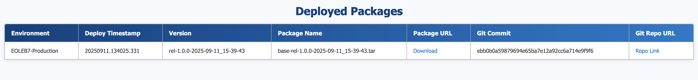

# IBM Wazi Deploy Reporting - List deployed packages by date

This template contains  [queryTemplate.yml](queryTemplate.yml), [renderer.yml](renderer.yml), [renderer.html](renderer.html) and a GitLab pipeline definition file for querying IBM Wazi Deploy evidence files to list the deployed packages within a specified time window.

## Overview and capabilities

This query template extracts information from the evidence file index to generate a report of packages deployed during a specific time window. The renderer formats the query results into a clear and concise deployment summary.

## Features

 Parses and indexes Wazi Deploy evidence files
  * Filters deployed packages by criteria (application, time window, environment)
  * Outputs clean, customizable deployment reports
  * Uses [queryTemplate.yml](queryTemplate.yml) for filtering logic
  * Supports custom renderers via [renderer.yml](renderer.yml) or [renderer.html](renderer.html)

## Usage

Use this template when you want to:

   * Track which packages were deployed during a particular time period
   * Audit deployment activity within specific date ranges
   * Analyze deployment trends and troubleshoot delivery issues

## Getting Started

To configure and use this template from a CI/CD pipeline coordinator interface, check out the provided implementation sample for [Gitlab/README.md](./Gitlab/README.md).

## Sample output of renderer
This can be downloaded and viewed after a successful run of the pipeline.
Eg:

